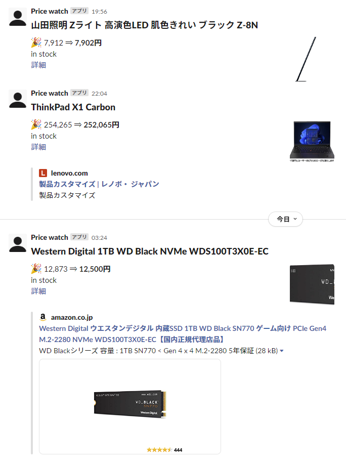

# price_watch

オンラインショップが掲載している価格を監視し，価格が下がった場合に Slack に通知するスクリプトです．



下記のようなオンラインショップで使えることを確認しています．(これら以外のショップにも使えます)

-   Amazon.co.jp
-   ヨドバシ.com
-   Yahoo ショッピング
-   Switch Science
-   Ubiquiti Store USA
-   Lenovo

## 準備

必要なモジュールをインストールします．
後述する Docker を使った方法で実行する場合は，インストール不要です．

```
sudo apt install -y python3-yaml
sudo apt install -y python3-coloredlogs
sudo apt install -y python3-pip
sudo apt install -y chromium-browser
sudo snap install chromium

pip3 install selenium
pip3 install webdriver-manager
pip3 install SpeechRecognition
pip3 install slack_bolt
```

## 設定

監視周期や Slack 通知に関する設定を `config.yaml` で指定します．
`config.example.yaml` を名前変更して設定してください．

監視対象に関する設定を `target.yaml` で指定します．
`target.yaml` の内容は定期的に再読み込みされますの内容で，プログラムを終了しなくても内容が反映されます．

設定方法方はファイルを見ていただけばわかると思います．

## 実行方法

```
./price_watch.py
```

Docker で実行する場合，下記のようにします．

```bash:bash
docker build . -t price_watch
docker run -it price_watch
```

`-i` は，画像認証を人力で解決するために必要になります．

## 画像認証突破方法

reCAPTCHA は自動的に処理しますが，それ以外の画像認証を求められた場合，ターミナルに入力を促す表示がでます．
data/debug フォルダの一番更新日時が新しい PNG ファイルを開くと，画像認証の画面が表示されていると思いますので，その内容をターミナルに入力してください．

# ライセンス

Apache License Version 2.0 を適用します．
